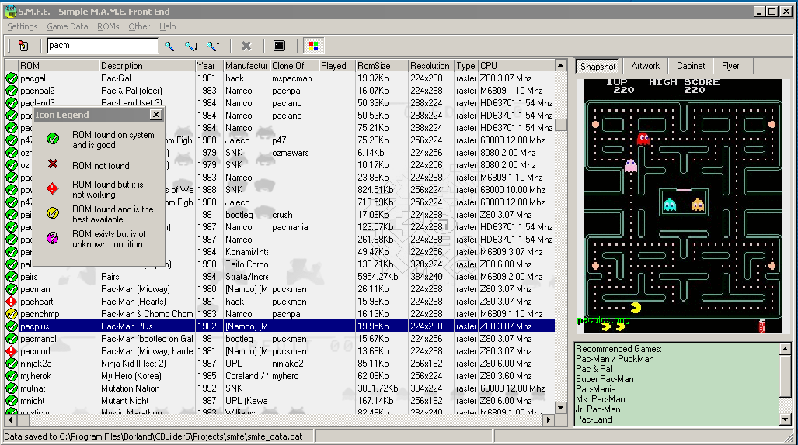

S.M.F.E. Simple M.A.M.E. Frontend **S.M.F.E.  
Simple M.A.M.E. Frontend**

Quote from pugsy's site: _"My current MAME frontend of choice, fully featured and requires no installation at all, just run the exe (so it even works with MAME straight off a dvdr with very little work). And it hasn't crashed once!"_ :-)

|     |     |
| --- | --- |
| **Download** |     |
| **Binary:** | • [smfe.exe](smfe.exe) \[2.8MB\] or [smfe12.rar](smfe12.rar) \[0.8Mb\] Version 0.12, (26/Jun/2005), tested with **MAME 0.97b**   • you may optionally get [smfe_data.rar](smfe_data.rar) \[0.9MB\] if you have trouble creating your own. |
| **Info:** | • No installation needed, just run smfe.exe. You must also have mame.exe (or mamepp.exe).   • Check "Help->Getting Started" on how to read game data et.c   • You can sort the table by multiple columns with shift+clicking on their headers   • smfe creates smfe_data.dat which contains all displayed table information, and smfe.ini which contains saved options   • **You must remove the old .dat file when you change smfe versions**   • If mame.exe can find MAMEINFO.dat, it will use it and smfe will display recommended games. |
| **Sources:** | You can get the sources (v0.9) [smfe09-src.rar](smfe09-src.rar). To compile it you will need Borland C++ Builder, Russian Extensions (RX), ADVStringGrid. |
| **Misc:** | A shell script (for unix) [getrom](getrom) to download a rom from www.mame.dk. Usage: "getrom &lt;romname&gt;". If you don't have the "[socket](http://home.snafu.de/jn/socket/)" program, use [netcat.](http://www.atstake.com/research/tools/index.html#network_utilities)**Update:** www.mame.dk has shut down. |
| **Old Binaries** | • [smfe11.rar](smfe11.rar) \[818Kb\] for MAME 0.83   • [smfe09.rar](smfe09.rar) \[818Kb\] Version 0.9, (30/Sep/2004), tested with **MAME 0.83**   • [smfe07.zip](smfe07.zip) version 0.7 (2/Sep/2002), for **MAME 0.61** |

|     |
| --- |
| **Features** |
| * Simple means simple to use (hopefully)! * Configurable image locations * Supports PNG, JPG, TIF, GIF, BMP & .ICO formats * Configurable mame.exe location * **Supports network drives & UNC paths (\\\hostname\\sharename\\directory)** * Can configure various MAME options for video, audio and input options and directory locations. * Also supports using the mame.ini configuration file  * Reads supported MAME games from the MAME executable * Checks for rom existence in the system (fast) * Checks for rom validity (not so fast) * Displays recommended games * Supports nplayers.ini parsing (# of players each game supports) * Supports HISTORY.DAT parsing (various game info) * Saves Table data into file to avoid rerunning time-consuming operations * Can kill the mame executable and change back screen resolution in case MAME hangs up. **(Ctrl+K)** * Tested only with Windows 2000      * Table columns include: ROM name, description, Year, Manufacturer, Clone Info, Played times, Rom Size, Emulated CPU, Game type (raster/vector), Resolution. * Supports **multi-column sort** (shift+click) * For each game there is additional info displayed which includes recommended games and other game info. * Can export all data in .XLS, .HTML and .TXT formats      * Options&paths are saved in smfe.ini, and game info/availability in smfe_data.dat at the same directory as the smfe.exe. It does **not** use the registry. * **Can run from read-only (CDROM/DVDROM) media** just generate the .dat file once and place along it with the .exe and .ini |
| **TODO** |
| * Record audio in .mp3 format (HELP!) * Display the main form rotated. This can already be done (with the driver options) if you have an nvidia card like GeForce. * Display only available roms in the table. Note: You can sort by the first column and have your available games on top. You can have a second sorting criterion by shift+clicking on the table column. * Mail me for ideas |
| **Screenshot (v0.4)** |
|    Click image to view the full-size capture. |
| **News** |
| * **26/Jun/2005:**version 0.12. Fixed bugs/typos, changed how verifysets is called, improved (hopefully) menu layout, fixed a bug which prevented games to start after a search for their name was performed. * **30/Sep/2004:**version 0.9. Now working with mame 0.83, nplayers.ini support + small bug fixes * **02/Sep/2002:**version 0.7. Fixed bugs with input devices. Thanks to Ric Kalford for the bug report. * **23/Jul/2002:**version 0.6. 2 new menu options: 1) autosave "played" field is now optional to improve loading times and 2) "save table data now". Fixed "save colun sizes" (hopefully). Added an "Auto fill" button when setting the executable/image/rom paths. Added new column: "Game Category" * **18/Jul/2002:**version 0.5. bug fixes + support for read-only media + display romset statistics + more debug output in console window * **04/Sep/2001:**version 0.4. Changed gamelist retrieve timeout + minor bug fixes * **04/Sep/2001:**Project progress will be delayed until 15 September due to other work. * **25/Aug/2001:**8402 page hits, 1200 downloads so far! unbelievable! * **19/Aug/2001:**version 0.3. First public version. Added some confirmation menus + screen resolution restoration code + minor bug fixes * **16/Aug/2001:**version 0.2. First public SMFE release (with announcement to freshmeat) * **09/Aug/2001:**Started writing the program. |
| **Links** |
| * [MAME](http://www.mame.net) * [Emuloader](http://www.mameworld.net/emuloader/), another frontend, very good. * [www.mame.dk](http://www.mame.dk/) arcade rom and information repository. |

  

  
Back to my [homepage](http://www.softlab.ece.ntua.gr/~sivann/)
